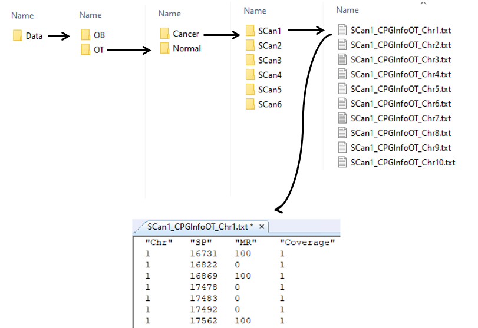

# Candidate_Primer_Region_Finder
## A simple and cost-effective approach for technical validation of next generation methylation sequencing data

### Requirment
  * tcltk r package

### Data structure

### Input parameters
 * OBorOT: Strand type of data ("OB" or "OT" outpur from bismark aligner)
 * limit_len_small: minimum region length with one CpG (defualt is 80)
 * limit_len_big: maximum region length with one CpG (default is 150)
 * CovThr: average depth per CpG sites in NGS data (in my data is 19)
 
### How to run
1. Initillize input parameters.
2. Run main r code.
3. Select data and code directory in directory chooser window.
4. Result will generate in code directory (result.txt). 

### Output
 Location of CpG site in the target region which sorted according to fisher ratio.
